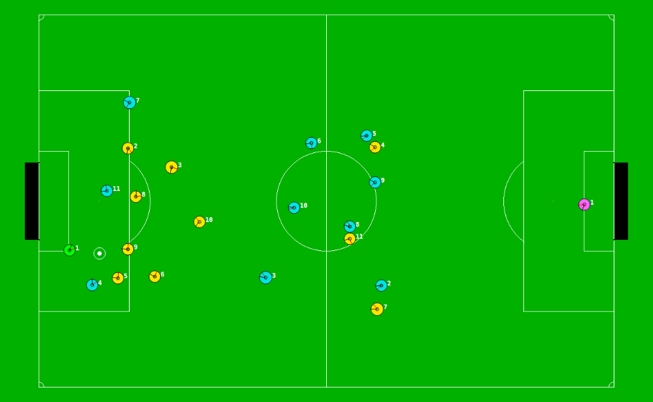

# wrighteaglebase
This is the release of WrightEagleBASE code, written in C++.

# Binaries
For latest WrightEagle binaries used in [RoboCup Soccer Simulation 2D](https://en.wikipedia.org/wiki/RoboCup_2D_Soccer_Simulation_League) competitions, please refer to: [http://aijunbai.github.io/wrighteagle2d/](http://aijunbai.github.io/wrighteagle2d/)

# References
Researchers are encouraged to cite following selected papers when using WrightEagleBASE/WrightEagle codes/binaries in research:

- [Online planning for large Markov decision processes with hierarchical decomposition](http://aijunbai.github.io/publications/BWCtist15.pdf), Aijun Bai, Feng Wu, and Xiaoping Chen, ACM Transactions on Intelligent Systems and Technology (ACM TIST),6(4):45:1–45:28, July 2015.
- [Online Planning for Large MDPs with MAXQ Decomposition (Extended Abstract)](http://aijunbai.github.io/publications/AAMAS12-Bai.pdf), Aijun Bai, Feng Wu,    and Xiaoping Chen, Proceedings of the 11th International Conference on Autonomous Agents and Multiagent Systems (AAMAS), Valencia, Spain, June 2012.
- [Towards a Principled Solution to Simulated Robot Soccer](http://aijunbai.github.io/publications/LNAI12-Bai.pdf), Aijun Bai, Feng Wu, and Xiaoping Chen,     RoboCup-2012: Robot Soccer World Cup XVI, Lecture Notes in Artificial Intelligence, Vol. 7500, Springer Verlag, Berlin, 2013.
- [WrightEagle and UT Austin Villa: RoboCup 2011 Simulation League Champions](http://aijunbai.github.io/publications/LNAI11-Bai.pdf), Aijun Bai, Xiaoping      Chen, Patrick MacAlpine, Daniel Urieli, Samuel Barrett, and Peter Stone, RoboCup-2011: Robot Soccer World Cup XV, Lecture Notes in Artificial Intelligence,    Vol. 7416, Springer Verlag, Berlin, 2012.
- Bounded Incremental Real-Time Dynamic Programming, Changjie Fan, and Xiaoping Chen, IEEE Proceedings of FBIT 2007, Jeju Island, Korea, 2007.
- Solving Large-Scale and Sparse-Reward DEC-POMDPs with Correlation-MDPs, Feng Wu, and Xiaoping Chen, Proceedings of RoboCup Symposium 2007. Atlanta, America, July 2007.

# Compilation
- `$make [debug]` for a debug version with debugging information and assertions.
- `$make release` for a release version

# Usages
A [RoboCup Soccer 2D Simulator](https://sourceforge.net/projects/sserver/files/) (as well as a monitor and a logplayer) is needed to run WrightEagleBASE. Please refer to [https://wavepackage.wordpress.com/2013/06/07/how-to-install-the-robocup-soccer-server-2d/](https://wavepackage.wordpress.com/2013/06/07/how-to-install-the-robocup-soccer-server-2d/) and [https://wavepackage.wordpress.com/2015/07/22/how-to-install-robocup-2d-simulation-server-on-ubuntu-14-04/](https://wavepackage.wordpress.com/2015/07/22/how-to-install-robocup-2d-simulation-server-on-ubuntu-14-04/) for installation instructions.  

After installation,  

- Run `$rcssserver` to start a soccer server which simulates the game
- Run `$rcssmonitor` to start a soccer monitor which is used to display the game
- Run `$./start.sh` to start a team on the left side with default teamname *WEBase*
- Run `$./start.sh -t [TEAMNAME]` to start a team on the right side with teamname *[TEAMNAME]*

After both teams connected, send a `KickOff` command to the server by hitting `Ctrl+K` in the monitor to start the game!

# Hacks
- `void Player::Run` in `src/Player.cpp` is the main loop of the agent consisting of sensing, decision-making and executing
- `ActiveBehavior DecisionTree::Search` in `src/DecisionTree.cpp` is the main decision-making loop
- `void Behavior*::Plan` in `src/Behavior*.cpp` implement planning part of behaviours following a MAXQ task structure
- `void Behavior*::Execute` in `src/Behavior*.cpp` implement executing part of behaviours following a MAXQ task structure

A good start to hack the team is digging into `void Behavior*::Plan` functions. The [MAXQ-OP](http://aijunbai.github.io/publications/BWCtist15.pdf) task structure of the agent:  

# Screenshot
A game screenshot between *WEBase* and *TestTeam*:  

